# FarmBid - Revolutionizing Agricultural Trading 🌾

<p align="center">
  <!-- Add your app logo here -->
  
</p>

<p align="center">
  <strong>Empowering Farmers, Connecting Buyers, Transforming Agriculture</strong>
</p>

## 📸 App Screenshots

### 🔐 User Authentication
<p align="center">
  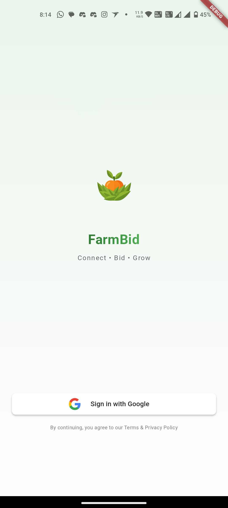
  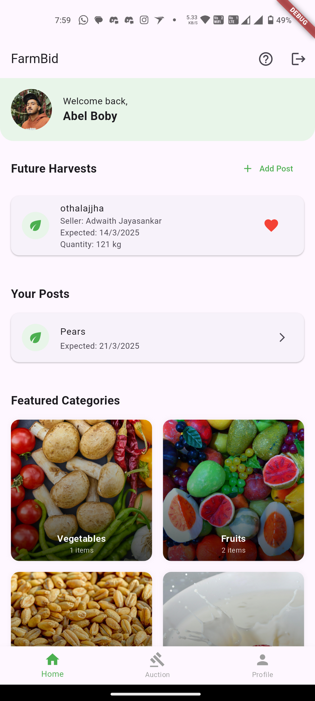
  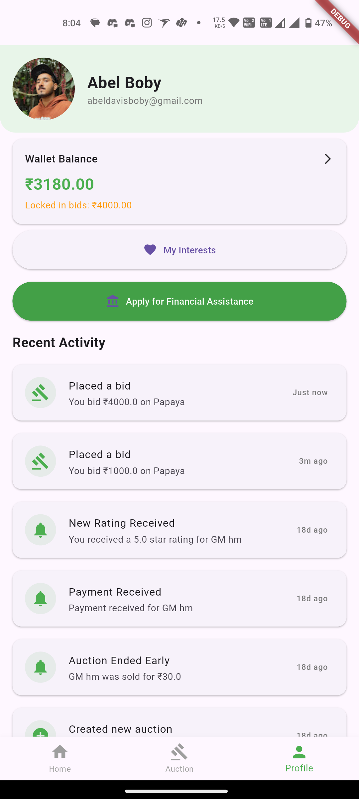
</p>

### 🏆 Auction System
<p align="center">
  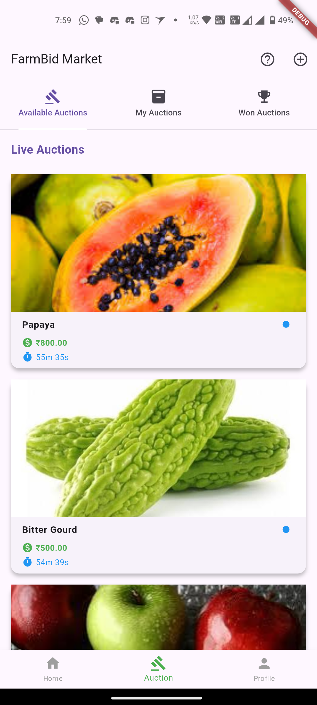
  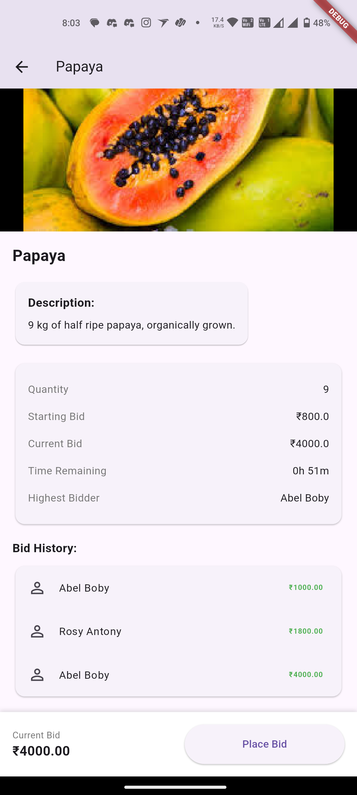
  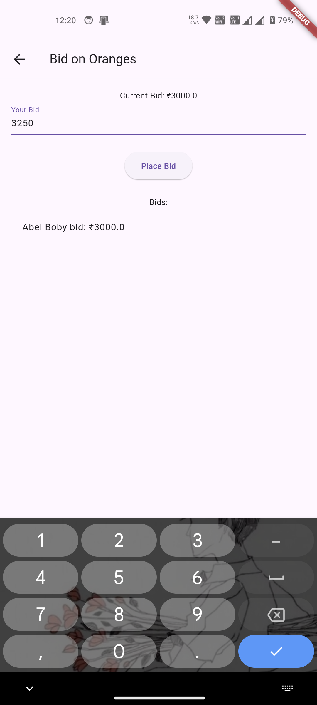
</p>

### 💰 Payments & Transactions
<p align="center">
  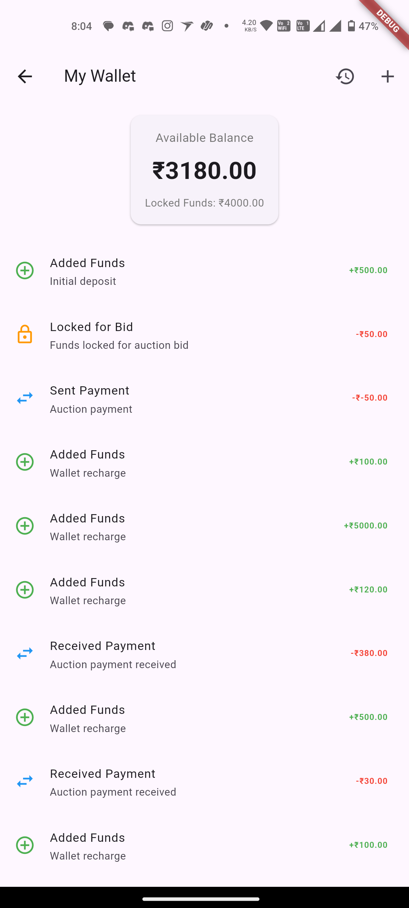
  
  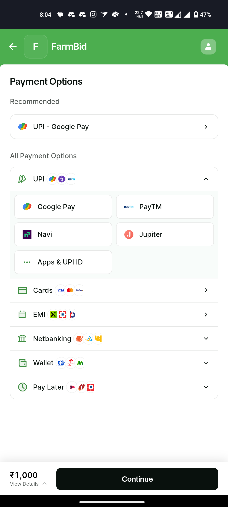
</p>

### 📦 Product Management
<p align="center">
  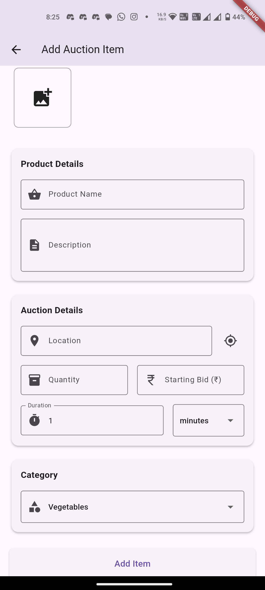
  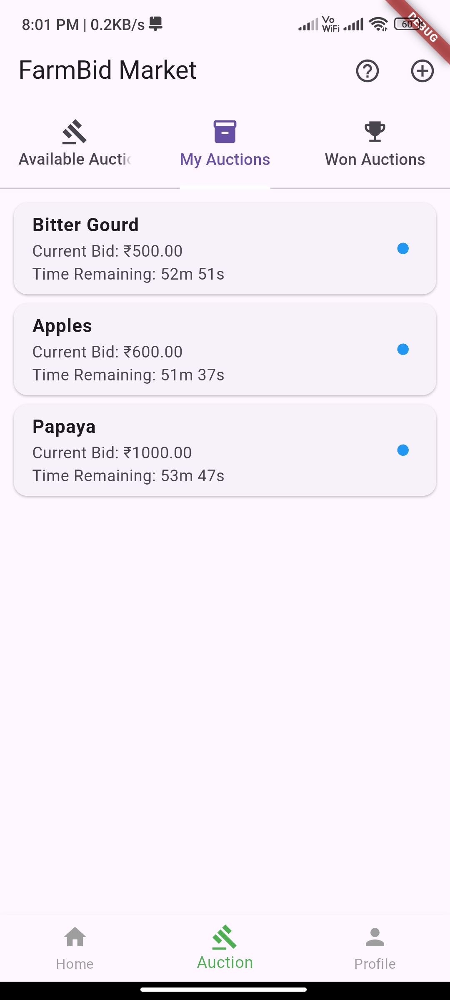
  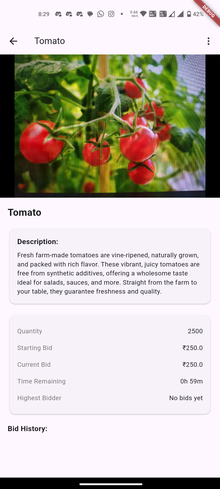
</p>

### 🎥 Product Delivery Process
https://github.com/user-attachments/assets/8d1740e9-3497-4701-96e7-18035e046d4a


Watch how winners receive their products after successful auctions, featuring:
- Delivery confirmation process
- Quality verification
- Secure handover protocol

## ✨ Features

### 🏆 Auction System
- **Live Bidding**: Real-time auction participation with instant updates
- **Pre-harvest Listings**: List products before harvest for better planning
- **Smart Closure**: Automatic auction closure with winner notification
- **Bid Tracking**: Comprehensive bid history and analytics
- **Multiple Categories**: Support for various agricultural products

### 💰 Financial Management
- **Secure Wallet**: Built-in wallet for seamless transactions
- **Smart Bidding**: Automatic fund locking during active bids
- **Multiple Payment Options**: Support for various payment methods
- **Transaction History**: Detailed financial tracking
- **Financial Assistance**: Support for farmers through various schemes

### 📍 Location Services
- **Smart Discovery**: GPS-based product and auction discovery
- **Delivery Options**: Flexible pickup and delivery choices
- **Route Planning**: Integrated Google Maps for logistics
- **Location Sharing**: Secure sharing for delivery coordination

### 👤 User Features
- **Profile Management**: Detailed user profiles for farmers and buyers
- **Rating System**: Product and user rating mechanism
- **Interest Management**: Customized product preferences
- **Notification Center**: Personalized alerts and updates
- **History Tracking**: Comprehensive transaction and activity history

### 🔒 Security Features
- **Secure Authentication**: Multi-factor authentication
- **Transaction Security**: Encrypted payment processing
- **Data Protection**: Secure user data handling
- **Fraud Prevention**: Advanced security measures

## 🛠️ Technical Stack

### Frontend
- **Framework**: Flutter & Dart
- **State Management**: Provider
- **UI Components**: Material Design & Custom Widgets
- **Local Storage**: SharedPreferences
- **Navigation**: Named Routes & Custom Transitions

### Backend Services
- **Firebase**
  - Authentication
  - Realtime Database
  - Cloud Storage
  - Cloud Functions
  - Analytics

- **Cloudinary**
  - Image Management
  - CDN Integration
  - Media Optimization

- **Payment Integration**
  - Razorpay Gateway
  - Secure Transaction Handling
  - Multiple Payment Methods

### APIs & Services
- **Google Maps**: Location Services
- **Push Notifications**: Firebase Cloud Messaging
- **Analytics**: Firebase Analytics
- **Crash Reporting**: Firebase Crashlytics

## 📲 Installation

```bash
# Clone the repository
git clone https://github.com/abelboby/FarmBid.git

# Navigate to project directory
cd FarmBid

# Install dependencies
flutter pub get

# Run the app
flutter run
```

## 🤝 Contributing

We welcome contributions! Please see our [Contributing Guidelines](CONTRIBUTING.md) for details.

## 📲 Download FarmBid

### Latest Release
[](https://github.com/abelboby/FarmBid/releases)

#### v1.0.0 (Latest)
- Initial release of FarmBid
- Live auction system with real-time bidding
- Secure payment integration with RazorPay
- Future harvest listings
- Product delivery tracking
- User authentication and profile management

[View Release Notes](https://github.com/abelboby/FarmBid/releases/tag/v1.0.0)

[View All Releases](https://github.com/abelboby/FarmBid/releases)

#### System Requirements
- Android 5.0 (API level 21) or higher
- 100 MB free storage space
- Internet connection required

---

<p align="center">
  Made with ❤️ for Indian Agriculture
</p>
